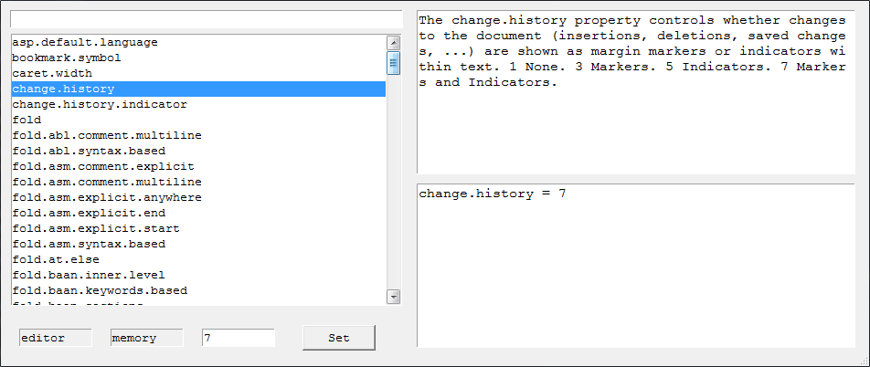
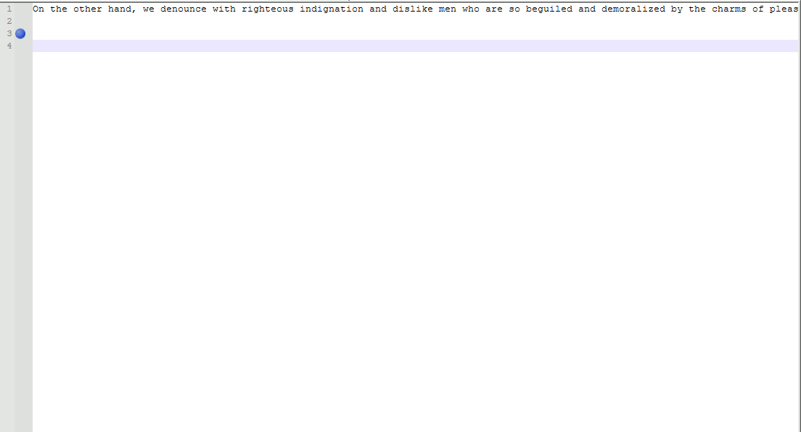

# XConfigUI

UI resized to maximum width.

 

On the left side from the top:

|Widget|Purpose|
|-|-|
|Entry|Filters the items in the listbox by substring matching.|
|Listbox|Property name that can be selected.|
|Label|Section of the setting. Can be "editor" or "lexer".|
|Label|Origin of the setting. Can be "memory", "defined" or "".|
|Entry|Value to be set for the selected property.|
|Button|Click to set the property value.|

The 1st entry can also filter by section name if the string starts with `[`.
So `[editor` or `[lexer` will list only the property names in that section.

The 1st label widget lets you know of the section name of the setting.
"editor" is typically related to Scintilla and "lexer" related to Lexilla.

The 2nd label widget lets you know of where the setting came from.
If set from xconfig.properties at startup or from setting from the UI,
then it will be "memory".
If the "memory" setting is cleared, then it becomes "defined".
If the setting is defined internally by Notepad++, then it will be "defined".
So basically "defined" implies that the setting is not recognized as "memory"
so it may have originated from other.
A property cannot be cleared once set, though it can be set back to default
and removed from "memory" so that it is not applied again with a buffer change.

At launch of the UI, you may only see the left side which keeps the UI compact.
The UI can be resized by gripping the right side edge of the window and drag
further right to enlarge. A gripper widget is located at the bottom right
which might be easier to grip.

On the right side from the top:

|Widget|Purpose|
|-|-|
|Text|Description of the property selected.|
|Text|List of settings in memory.|

The bottom text widget lets you know what has been set in memory.
This can be useful to know what has been set, though also what
settings could be copied into *xconfig.properties*.

A preview of the UI setting properties which affect Notepad++:

 

 1. Changes line wrap settings as Notepad++ has some settings though
    not all in preferences.
 2. Changes bookmark marker symbol and colour from white to red.
 3. Changes visibility of markers and indicators of Change History.
    Showing indicators can be useful to see the fine detail of the changes.
 4. Changes the symbols of the indicators of Change History from an
    underline to a fullbox.
 5. Changes the colours of the markers and indicators of Change History.
    Type reverted from lime to red.
    Type saved from green to blue.
    Type modified from orange to light blue.
 6. Changes the saved marker symbol of Change History.
